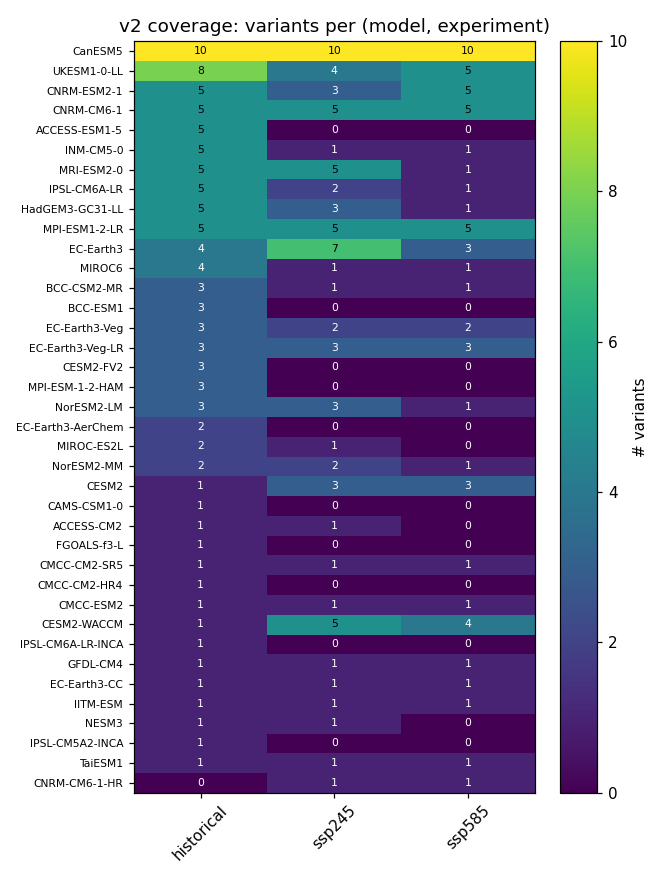
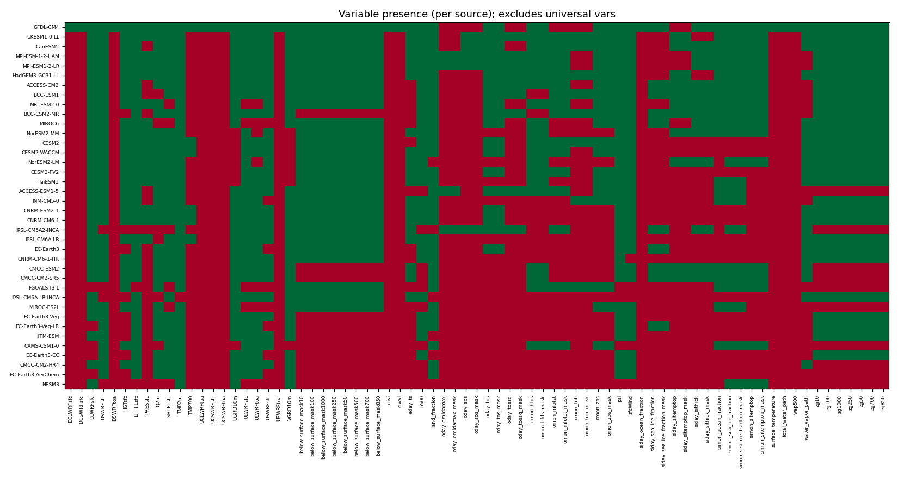
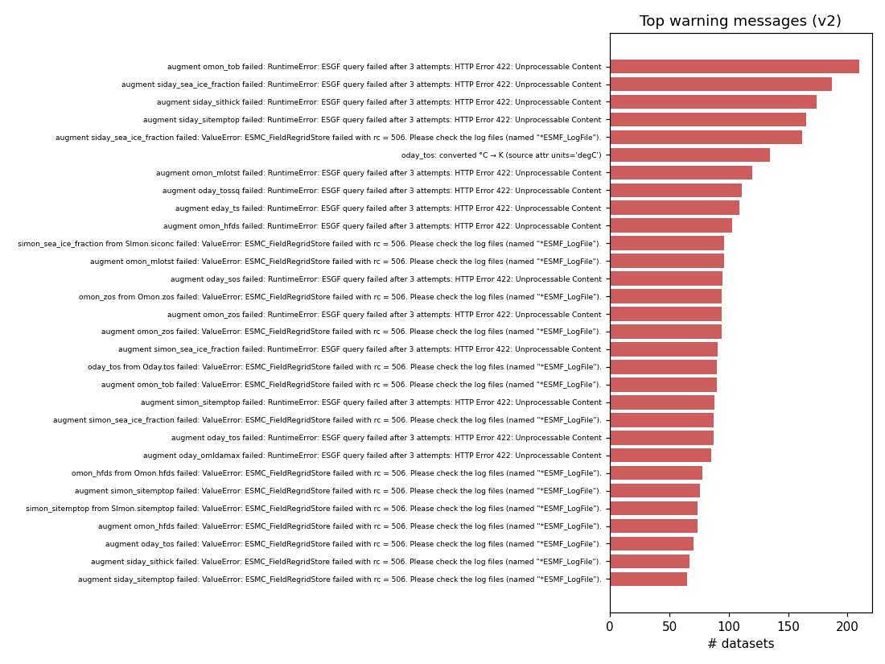
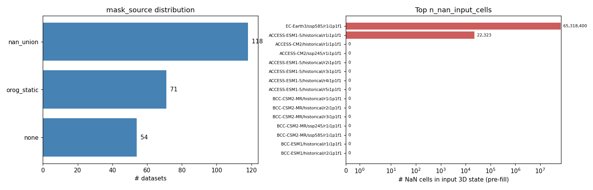
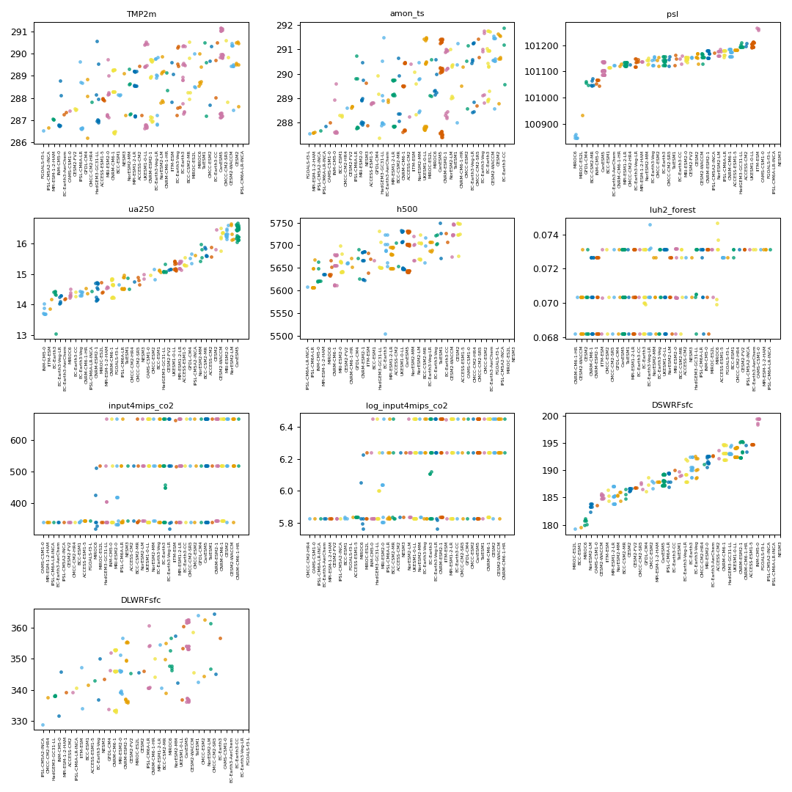
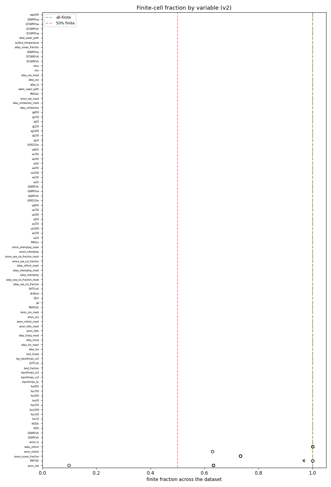
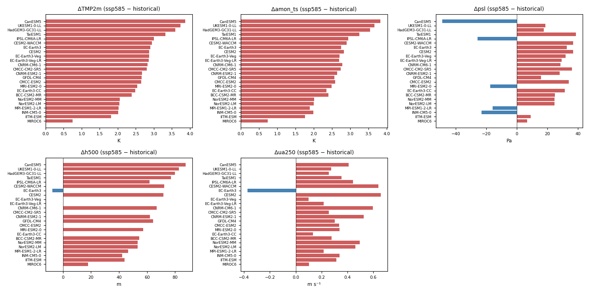
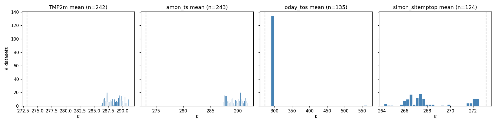

# CMIP6 daily v2 cohort report

**Bucket:** `gs://vcm-ml-intermediate/2026-05-22-cmip6-multimodel-daily-4deg-8plev-1940-2100/v2/`
**Window:** historical 1950–2014, ssp245 / ssp585 2015–2100
**Target grid:** F22.5 Gauss–Legendre 45 × 90
**Successful datasets:** 243 (all `status="ok"`)
**Schema version:** 0.7.0 (post-BCC corruption truncation)

This report aggregates per-dataset `metadata.json` sidecars and
`stats.nc` files from the v2 cohort — the production CMIP6 ingest
that succeeded the `v0-pilot` run. Everything in here was produced
by `build_report_v2.py`; the underlying tables are
[`stats_aggregated.csv`](stats_aggregated.csv),
[`outliers.csv`](outliers.csv), and the
[`SUMMARY.md`](SUMMARY.md) auto-summary. All plots are in
[`plots/`](plots/) and referenced inline below.

The headline finding for v2 is that the cohort is clean enough to
train on. Several issues that were flagged in the pilot — `sftlf`
on inconsistent scales, ocean-regrid drop-outs, `oday_tos` in degC
— were fixed in the pipeline before v2 ran. Two issues remain that
training code should be aware of: a real (not buggy) MIROC6
pressure bias, and a publisher-side full-slab NaN issue at
EC-Earth3 ssp585 r1.

---

## 1. Coverage



- 38 source models × 3 experiments (`historical`, `ssp245`,
  `ssp585`). The pilot's `ssp126` and `ssp370` are intentionally
  out of scope for v2.
- Per-experiment dataset counts: **historical 108, ssp245 75,
  ssp585 60.** historical has the most variants per model because
  it's where the cohort agrees best on what to publish; ssp585 has
  the fewest because daily 3D state isn't published for many models
  under high-emission scenarios.
- Variants per source range from 1 to 30 (median 4) — EC-Earth3
  and CanESM5 dominate the top, several smaller-team models
  contribute one variant.
- Calendars present: `noleap` 92, `proleptic_gregorian` 66,
  `standard` 56, `360_day` 26, `julian` 3. Time-step counts work
  out cleanly per-calendar; downstream code already handles all
  five.
- Data source split: 158 datasets came via `pangeo+esgf` (Pangeo
  for core 3D variables, ESGF for ocean/sea-ice augments); 85
  came from `pangeo` alone (models without ocean augment).
- 24 sources have both `historical` and `ssp585` — this is the
  set the warming-response analysis (§7) operates on.

## 2. Variable presence



- **Surface met / 3D state / 8-level pressure variables / external
  forcings** are universal — present in all 243 datasets. The
  pipeline's hard requirement on the core variable set means
  anything that didn't land them was dropped at process time.
- **Ocean + sea-ice augments** are sparse and per-model:
  - `oday_tos`: 135 / 243 (56%)
  - `omon_zos`: 142 / 243 (58%)
  - `omon_mlotst`: 106 / 243 (44%)
  - `omon_hfds`: 132 / 243 (54%)
  - `simon_sea_ice_fraction`: 143 / 243 (59%)
  - `simon_sitemptop`: 124 / 243 (51%)
  - `siday_sithick`: 66 / 243 (27%)

  Most absences are publisher-side (the model doesn't publish the
  variable on a regridable grid), not regrid failures — the
  `bounds_to_vertices` chunking bug from the pilot is fixed.
- **`below_surface_mask*`**: 189 / 243 (78%) — the rest are models
  without 3D state. Per-plev counts are identical across all eight
  levels, confirming the mask is computed jointly across `(ua, va,
  hus, zg)`.
- **A few "private" variables** show up in only 1-3 datasets
  (`clivi`, `clwvi`, `total_water_path`, `DCLWRFsfc`, etc.) —
  these are ESGF augments specific to single publishers that the
  pipeline lets through but training code should explicitly
  ignore.

## 3. Pipeline warnings



The most common warnings are the same broad families as the pilot
but at proportionally lower counts because the pilot's biggest
failure modes are fixed:

- **`<var> sanity: out of range`** — per-variable diagnostics from
  the `_SANITY_RANGES` advisory tables, retained as soft warnings
  rather than processing errors. Mostly real model spread (CMIP6
  cohorts disagree on absolute precipitation, shortwave radiation,
  etc. by amounts that exceed any reasonable single-value range).
- **`<augmented variable> from <table> failed`** — the per-dataset
  augmentation path's per-variable failures. Lower than pilot
  rates because the ocean-regrid path is fixed.
- **`core variables absent (tolerated)`** — models that don't
  publish every level of `ua/va/hus/zg` but still passed because
  `max_core_missing` is 0 by default but augments don't count
  against it.
- **Temperature unit harmonization** notes — recording when a
  variable came in as degC and was lifted to K. The pilot's
  `oday_tos` problem manifests as a `harmonize_temperature_to_kelvin`
  warning in v2.

## 4. Below-surface mask + input-NaN distribution



- **`mask_source = nan_union`** (118 / 243): the most common
  mask path. Publishers emitted NaN under topography on at least
  one of `(ua, va, hus, zg)`, and the union becomes the
  below-surface mask. No `orog`-based fallback needed.
- **`mask_source = orog_static`** (71 / 243): no 3D NaNs observed,
  so the mask is derived from `zg < orog` per pressure level.
- **`mask_source = none`** (54 / 243): datasets without 3D
  pressure-level state. The training-time below-surface concept
  doesn't apply.

The `n_nan_input_cells` tail surfaces one publisher-side outlier:

- **EC-Earth3 / ssp585 / r1i1p1f1** — **65,318,400** NaN input
  cells (~3 plev levels × ~31,400 timesteps × all spatial cells).
  This is a full-slab pattern, identical in shape to the
  pilot-era HadGEM3-GC31-MM / EC-Earth3 cases. The nearest-above
  fill mops it up but the input volume is unusual; worth a
  manual scan of `data.zarr` if this variant is selected for
  inference.
- **ACCESS-ESM1-5 / historical / r1i1p1f1** — 22,323 cells.
  Small enough to be incidental publisher noise; flag for
  awareness but not action.

All other 241 datasets report zero pre-fill NaNs.

## 5. Cross-model agreement (means)



Per-variable strip plot of per-dataset means, one column per
source_id (one dot per ensemble variant). Sources are ordered by
their cohort-mean position so visible drift along the x-axis
indicates a systematic per-source bias.

- **Tight cohort** for `TMP2m`, `amon_ts`, `psl`, `h500`,
  `luh2_forest`, `input4mips_co2/so2/bc`: spreads are small
  relative to the mean — `psl` for example sits at ~101,000 Pa
  cohort-wide with per-source means scattering by ~300 Pa total.
  External-forcing variables collapse to a single value across
  sources (they're per-experiment files, so this is just a sanity
  check that the same file was read everywhere).
- **Wider for** `pr`, `DSWRFsfc`, `DLWRFsfc`, `rlut`, `ua250` —
  expected; precip and radiation vary substantially across
  models, and 250 hPa zonal wind reflects each model's jet
  position.
- **One-sided outliers**:
  - MIROC6 sits at the cold-pressure end of `psl` across all its
    variants (real model bias, not a unit issue — see §8).
  - EC-Earth3 sits low on `h500` for one ssp585 variant
    specifically (see §8).
  - INM-CM5-0 sits cold for `TMP2m` and `amon_ts` and shifted on
    several pressure-level vars — a small-pole-warming model that
    looks like an outlier on global means.

## 6. Cross-model agreement (finite fraction)



Boxplot of `finite_fraction` per variable across the cohort.
Variables sit at 1.0 (all-finite) for nearly everything; the
ocean-and-ice variables sit between 0.5 and 1.0 reflecting their
land-NaN domain. Two variables draw the eye:

- **`omon_tob`** (ocean bottom temperature): min = 0.099, median
  = 1.000 — most datasets are fine, but at least one ends up with
  ~10% finite cells. Likely a publisher with sparse bottom
  topography metadata that regrids onto only a thin shelf. Not
  a processing bug; worth a manual look if `omon_tob` enters
  training.

No variable has an unexpected NaN signature — masks land where
masks should land.

## 7. Warming response (ssp585 − historical)



For each of 24 sources with **both** historical and ssp585
ensemble means, the per-source delta on five scalars. Sources are
ordered by ΔTMP2m so the climate-sensitivity pattern reads
top-to-bottom.

- **ΔTMP2m** spans **+0.75 K (MIROC6) to +3.83 K (CanESM5)** — a
  ~5× spread, consistent with CMIP6's well-known ECS bimodality.
  The "high-ECS cluster" (CanESM5, UKESM1-0-LL, HadGEM3-GC31-LL,
  TaiESM1) all land above +3.5 K. The "low-ECS cluster" (MIROC6,
  IITM-ESM, INM-CM5-0, MPI-ESM1-2-LR) all land below +2.0 K. Most
  models pile near the cohort median ~2.7 K. This is the spine
  of the dataset's out-of-sample generalization signal: training
  on the cohort middle leaves room to probe extrapolation toward
  CanESM5 / MIROC6.
- **Δamon_ts** (skin temperature) tracks ΔTMP2m almost
  perfectly — same ordering, same magnitudes. Useful as
  cross-validation that the two temperature fields aren't
  diverging in unexpected ways.
- **Δpsl** is mostly positive (warming → sea-level pressure rises
  at the cohort mean) but **CanESM5 (−51 Pa) and IPSL-CM6A-LR
  (−25 Pa)** invert the sign. INM-CM5-0 and MRI-ESM2-0 are also
  small-negative. This is a real high-ECS signature — strong
  warming weakens the Hadley cell which can reduce subtropical
  high-pressure ridges.
- **Δh500** is strongly positive everywhere (the 500-hPa surface
  rises with warming because lower-troposphere thickness
  increases). 60-90 m across most models, EC-Earth3 ssp585 the
  one anomaly (slightly negative, ~ -10 m). See §8.
- **Δua250** is positive almost everywhere (~+0.2 to +0.7 m/s, jet
  intensification with warming) — **except EC-Earth3 ssp585**
  which is strongly negative (~−0.4 m/s), again the same outlier.

Why CanESM5 / UKESM1 / HadGEM3 / TaiESM1 cluster together:
they share the UM atmosphere or a related dynamical core and
similar cloud-feedback parameterizations, so their forced
responses also cluster.

## 8. ⚠️ Things to know before training

### a) MIROC6 has a real low-pressure bias

The top 6 outliers in [`outliers.csv`](outliers.csv) are all
MIROC6 `psl` variants (`z = −4.45 to −4.67`), present in both
historical and SSP scenarios. Cohort-mean `psl` is 101,137 Pa;
MIROC6 lands ~290 Pa lower. MIROC6 `input4mips_so2` is also
flagged at `z = −4.11`.

This is real model bias, not a units issue. Mitigations:

- **Per-source normalization** rather than cohort normalization
  for `psl` (already supported via `Cmip6Step`'s per-source
  mode). MIROC6 then sees a near-zero mean post-norm rather than
  a −4σ shift.
- **Use MIROC6 as the low-ECS holdout** — the model's biases are
  consistent across variants and across `historical → ssp585`,
  so withholding it tests "can the network handle a model that's
  shifted globally and has muted warming sensitivity."

### b) EC-Earth3 ssp585 r1i1p1f1 has full-slab NaN cells AND an anomalous warming response

Two unrelated things, but both on the same dataset:

1. **65.3 M pre-fill NaN cells** — full pressure-level slabs of
   NaN at indices the nearest-above fill ends up covering. The
   resulting filled values are not necessarily nonsense (fill is
   conservative) but the volume of fill is unusual.
2. **Δh500 ≈ −10 m and Δua250 ≈ −0.4 m/s** — both are
   sign-reversed relative to the rest of the cohort. EC-Earth3's
   _other_ ssp585 variants don't show this pattern (the warming
   response plot uses ensemble means and they're still
   reasonable), but r1 alone may carry an idiosyncratic forcing
   path.

For training: either exclude r1 specifically (other EC-Earth3
ssp585 variants are clean), or use this dataset as a
"deliberately weird" sample to probe robustness. The
`selection.exclude_variants` mechanism handles per-variant
exclusion cleanly.

### c) BCC-CSM2-MR historical r1i1p1f1 had a corrupt last day (now truncated)

The source Pangeo zarr's 2014-12-31 was corrupt across every
pressure-level variable — `ua` peaked at ~88,400 m/s, `va`
~440 m/s, `hus` 8400× cohort norm at the model top, `zg` up to
54× typical at 1000 hPa. The corruption was sharp: global-mean
ua500 jumped ~3,200× in one step from 2014-12-30, with no
warning over the preceding 10 days.

The 0.6.0 → 0.7.0 migration truncated the bad timestep
(`n_timesteps`: 23725 → 23724, `time_end`: 2014-12-31 →
2014-12-30) and regenerated this dataset's stats. The migration's
three-guard safety check (sidecar identity + expected pre-state +
on-disk corruption signature) ensures it would refuse to truncate
a clean dataset even if the identity check somehow matched the
wrong row. Sibling variants (BCC-CSM2-MR r2, r3, ssp245 r1,
ssp585 r1) were verified clean and untouched.

### d) Tight TMP2m variance means inter-model variability is limited

`TMP2m` historical cohort std is small relative to the warming-
response spread — most of the variability we want a network to
learn comes from the warming dimension, not the inter-model
dimension. Implication: a training run that only sees the
historical period will see a much narrower distribution than one
that mixes in ssp585. The §7 warming-response plot is the right
visual reminder of this.

### e) `omon_tob` finite-fraction tail

One dataset has `omon_tob` at ~10% finite cells. The pipeline
allows variables that don't survive regrid to be absent rather
than failing the whole dataset, but a 10%-finite variable is in
between "present" and "absent" and downstream training stacks
need to either mask or exclude it on a per-sample basis.

### f) Temperature units (no issues this time)



All temperature variables sit comfortably between 200 K and 320 K
on a per-dataset-mean basis. No datasets with `mean < 100 K`
(the pilot's `oday_tos`-in-degC failure mode). The
`harmonize_temperature_to_kelvin` step and the 0.5.0 → 0.6.0
post-hoc degC migration both ran cleanly. `simon_sitemptop` no
longer shows the NorESM2-LM / NorESM2-MM 88-K artifact — the
`skipna=True` regrid fix from the pilot generation cleared it.

## 9. Reproducing this report

```bash
cd scripts/cmip6_data/report
python build_report_v2.py
```

The script reads `gs://.../v2/index.csv` for the dataset list,
streams each per-dataset `stats.nc` into a flat
`stats_aggregated.csv`, and emits the plots in `v2/plots/`. End-
to-end runtime is ~6 minutes (the bottleneck is downloading 243
stats.nc files serially because the GCS + h5netcdf combination
segfaults under thread parallelism).

Re-run after any sidecar / stats refresh; safe to invoke
repeatedly (overwrites plots in place, no side effects beyond
the `report/v2/` directory).
