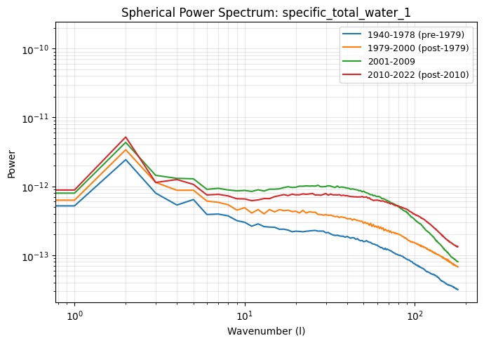
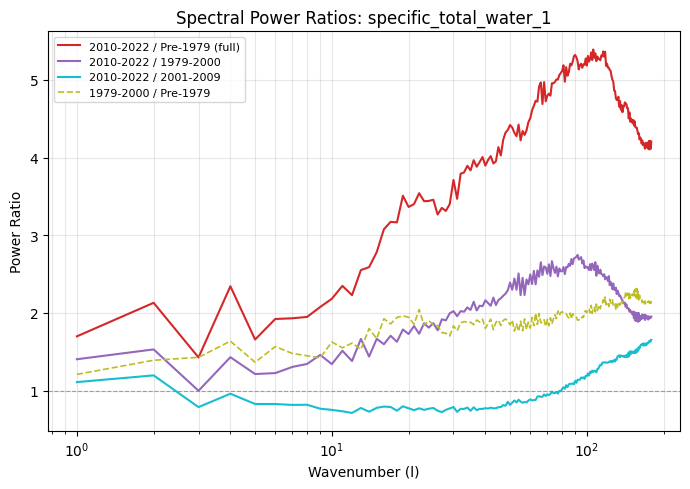
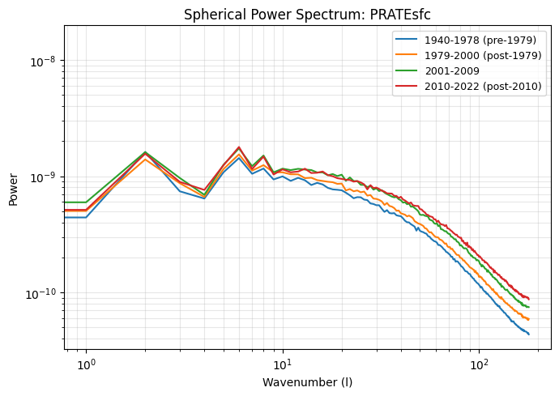
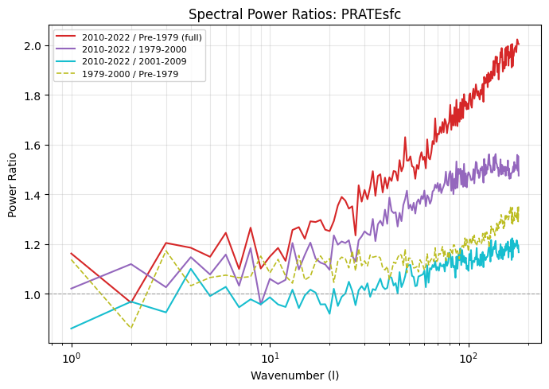
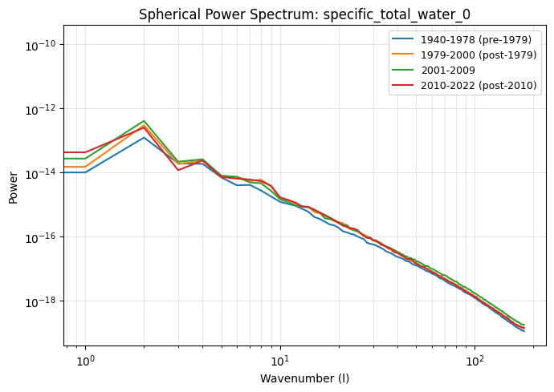
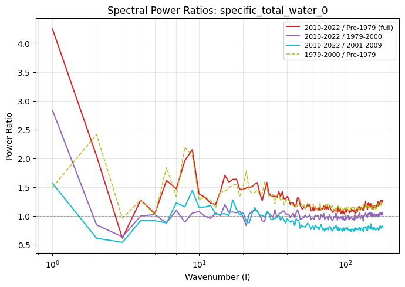
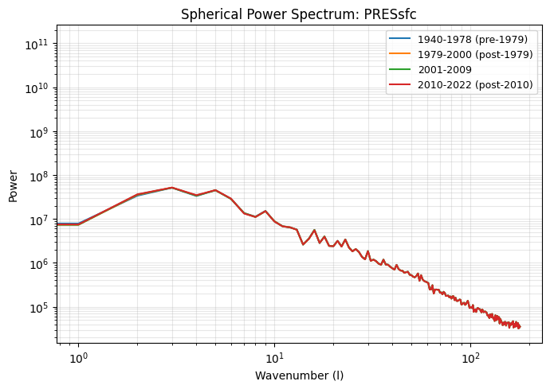
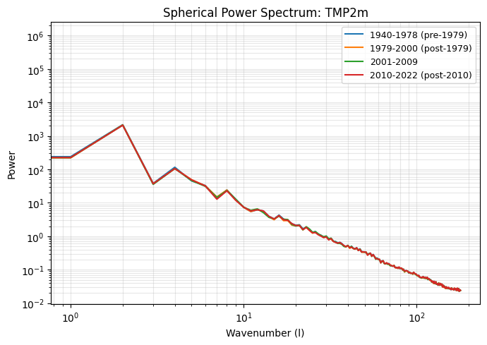
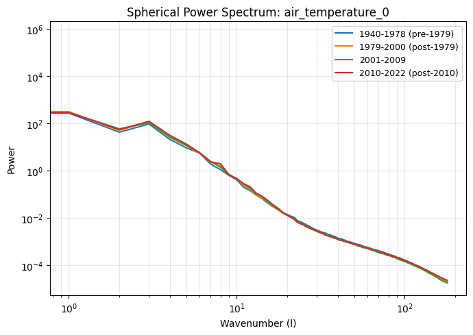
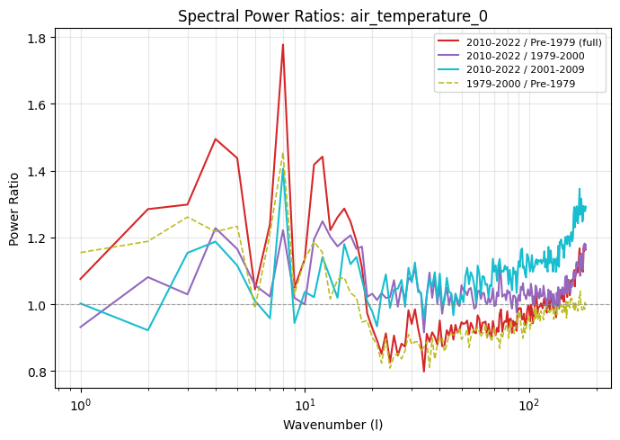

# ERA5 Spectral Power Evolution Across Time Periods

## Context

A colleague observed that the spherical power spectrum shows wildly differing small-scale spectral power between the start and end of the simulation period. This analysis quantifies how much of that difference is attributable to the pre-1979 regime shift (where we define the training split) versus ongoing drift in the post-1979 era, and whether the known 2010 ERA5 stream boundary contributes.

We compute spherical power spectra using the same method as ACE's inference metrics (`fme.core.metrics.spherical_power_spectrum`): forward spherical harmonic transform followed by summing |coefficients|^2 over all zonal wavenumbers m for each total wavenumber l.

Analysis script: `s07_spectral_power_periods.py`. Plots in `plots/spectral_power_*.png` and `plots/spectral_ratio_*.png`.

### Periods

| Period | Years sampled | Rationale |
| ------ | ------------- | --------- |
| Pre-1979 | 1945, 1950, 1955, 1960, 1965, 1970, 1975 | Before training split / regime shift |
| 1979-2000 | 1980, 1985, 1990, 1995, 2000 | Post-split, pre-2000 stream boundary |
| 2001-2009 | 2002, 2004, 2006, 2008 | Between 2000 and 2010 stream boundaries |
| 2010-2022 | 2011, 2014, 2017, 2020 | Post-2010 stream boundary |

12 evenly-spaced timesteps per year, full lat-lon fields on the 180x360 grid.

---

## Summary of Results

### Small-scale power ratios (top 20% of wavenumbers)

| Variable | 2010-2022 vs Pre-1979 | 2010-2022 vs 1979-2000 | 2010-2022 vs 2001-2009 | 1979-2000 vs Pre-1979 | 2001-2009 vs 1979-2000 |
| -------- | --------------------- | ---------------------- | ---------------------- | --------------------- | ---------------------- |
| specific_total_water_1 | **4.31x** | 1.97x | 1.55x | 2.19x | 1.27x |
| PRATEsfc | **1.97x** | 1.50x | 1.18x | 1.31x | 1.27x |
| specific_total_water_0 | **1.19x** | 1.02x | 0.79x | 1.17x | 1.30x |
| eastward_wind_0 | 1.16x | 1.18x | 1.13x | 0.99x | 1.04x |
| air_temperature_0 | 1.10x | 1.10x | 1.25x | 1.00x | 0.88x |
| air_temperature_7 | 1.02x | 1.02x | 1.01x | 1.00x | 1.01x |
| TMP2m | 1.01x | 1.01x | 1.00x | 1.00x | 1.01x |
| PRESsfc | 0.99x | 1.00x | 1.00x | 1.00x | 1.00x |
| specific_total_water_7 | 0.99x | 0.99x | 1.01x | 1.00x | 0.98x |

### RMSE of log10(power ratio) across all wavenumbers

| Variable | 2010-2022 vs Pre-1979 | 2010-2022 vs 1979-2000 | 2010-2022 vs 2001-2009 | 1979-2000 vs Pre-1979 | 2001-2009 vs 1979-2000 |
| -------- | --------------------- | ---------------------- | ---------------------- | --------------------- | ---------------------- |
| specific_total_water_1 | **0.636** | 0.343 | 0.125 | 0.297 | 0.320 |
| PRATEsfc | **0.230** | 0.151 | 0.053 | 0.081 | 0.103 |
| specific_total_water_0 | **0.109** | 0.043 | 0.099 | 0.098 | 0.094 |
| eastward_wind_0 | 0.063 | 0.071 | 0.065 | 0.032 | 0.034 |
| air_temperature_0 | 0.049 | 0.031 | 0.059 | 0.039 | 0.039 |
| specific_total_water_7 | 0.015 | 0.013 | 0.014 | 0.010 | 0.014 |
| TMP2m | 0.013 | 0.012 | 0.013 | 0.013 | 0.012 |
| air_temperature_7 | 0.011 | 0.014 | 0.016 | 0.012 | 0.013 |
| PRESsfc | 0.005 | 0.003 | 0.002 | 0.003 | 0.002 |

---

## Key Findings

### 1. specific_total_water_1 has the most extreme spectral evolution

Tropopause-level moisture (level 1, ~98 hPa) shows **4.3x** more small-scale power in 2010-2022 compared to pre-1979 — the largest shift of any variable by a wide margin. The RMSE of the log-ratio (0.636) is 3x larger than the next-worst variable. The shift is progressive: ~2.2x at the 1979 boundary, another ~1.3x by 2009, and another ~1.6x by 2010-2022. The spectral ratio plots show the curves fanning apart at all scales, reaching 3-5x at the highest wavenumbers.

This likely reflects improvements in ERA5's representation of upper-tropospheric/lower-stratospheric water vapor as satellite observations (especially from EOS-era instruments post-2000 and COSMIC GPS-RO post-2006) were progressively incorporated.

### 2. PRATEsfc shows a large, steady increase in small-scale power

Precipitation rate shows **~2x** more small-scale power in 2010-2022 vs pre-1979. Unlike `specific_total_water_0` where the shift is concentrated at 1979, PRATEsfc evolves progressively across all period boundaries (1.31x, 1.27x, 1.18x in successive intervals). This suggests ongoing improvements to ERA5's convection parameterization and data assimilation rather than a single regime shift.

### 3. specific_total_water_0 shift is dominated by the 1979 boundary

Stratospheric moisture (level 0, ~26 hPa) shows a 1.19x total shift, but most of it (1.17x) occurs at the pre-1979 to 1979-2000 boundary. The post-1979 periods have similar spectra to each other (ratios near 1.0). This is consistent with the known ERA5 observing system change around 1979 (satellite era begins).

### 4. Surface and near-surface variables are spectrally stable

`PRESsfc`, `TMP2m`, `air_temperature_7`, and `specific_total_water_7` all show ratios within 2% of 1.0 across all period comparisons. Their spectra are essentially unchanged over the 80-year record. These variables are well-constrained by surface observations throughout the period.

### 5. Upper-atmosphere dynamics show moderate shifts

`eastward_wind_0` and `air_temperature_0` show moderate spectral evolution (5-25% shifts), with some evidence of a change around the 2010 stream boundary. For `air_temperature_0`, the 2001-2009 period is notably different from both its neighbors — the 2010-2022 vs 2001-2009 ratio (1.25x) exceeds the 2010-2022 vs 1979-2000 ratio (1.10x), suggesting spectral character shifted at the 2010 boundary.

---

## Implications for Training

1. **The pre-1979 regime shift matters most for `specific_total_water_0`**, but **post-1979 evolution matters most for `specific_total_water_1` and `PRATEsfc`**. A model trained on the full 1979-2022 range will see substantially different spectral characteristics between early and late training data for these variables.

2. **Normalization statistics** computed over 1990-2019 (as in the current config) may not adequately represent the spectral structure of the early post-1979 period, particularly for tropopause-level moisture and precipitation.

3. **The 2010 stream boundary** introduces noticeable spectral shifts in upper-atmosphere variables, though smaller than the 1979 boundary. This could affect validation if training and validation data span this boundary differently.
